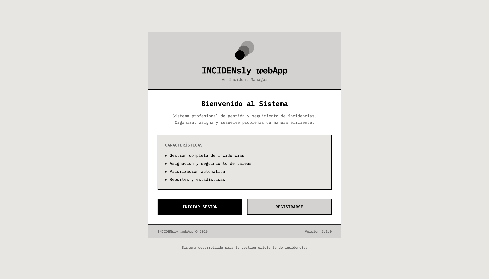
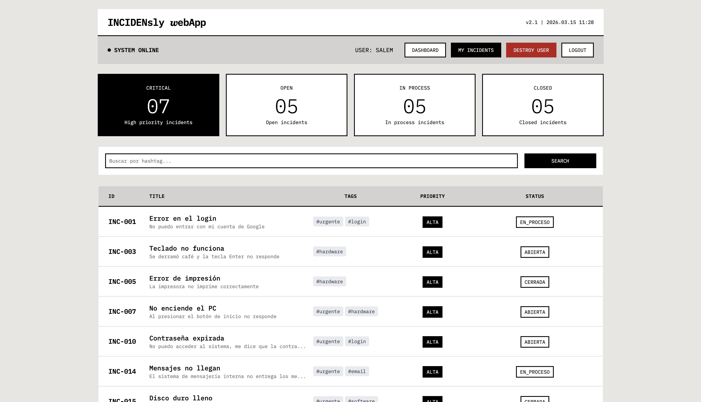
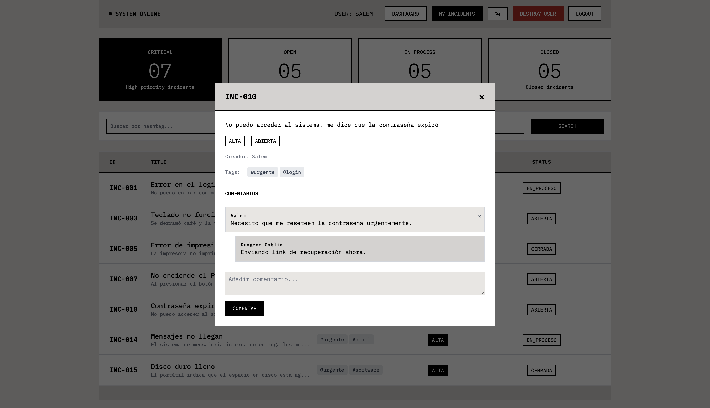
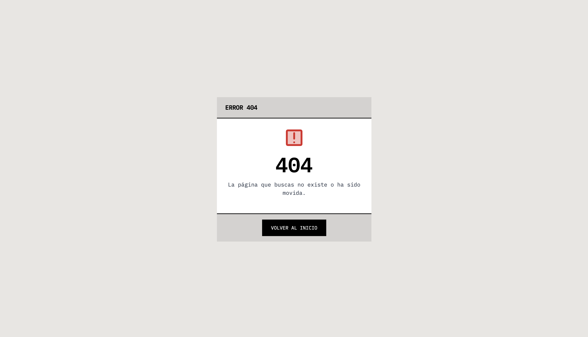
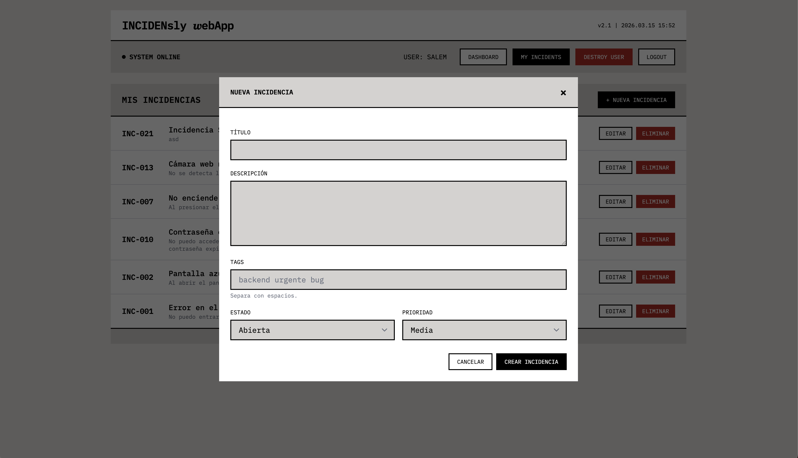

# Documentación Técnica `INCIDENsly 𝒘ebApp`


## 1. Resumen del Proyecto

Este proyecto consiste en una aplicación web desarrollada con Laravel 12 para la gestión de incidencias. Permite a usuarios autenticados crear, editar, eliminar y visualizar incidencias con un sistema de etiquetas y comentarios anidados. El sistema incluye un panel de métricas para analizar la cantidad y estado de las incidencias.

**Características principales:**

- Autenticación de usuarios mediante Laravel Breeze
- CRUD completo de incidencias
- Sistema de etiquetas (relación muchos a muchos)
- Comentarios anidados (respuestas a comentarios)
- Panel de métricas con filtros dinámicos

---

## 2. Requisitos e Instalación

### Requisitos del sistema

- PHP 8.2 o superior
- Composer
- Node.js y npm
- MySQL

### Pasos de instalación

```bash
# 1. Clonar el repositorio y acceder al directorio
https://github.com/malmental/S4_Laravel_MVC.git

# 2. Instalar dependencias PHP
composer install

# 3. Copiar archivo de entorno
cp .env.example .env

# 4. Generar clave de aplicación
php artisan key:generate

# 5. Ejecutar migraciones
php artisan migrate --seed

# 6. Instalar dependencias frontend
npm install

# 7. Compilar recursos
npm run build
```

### Ejecución del proyecto

```bash
# Servidor de desarrollo
php artisan serve

# O usar el script de composer (servidor + queue + logs + vite)
composer dev

# Compilar para producción
npm run build
```

### Usuarios para Login 

```bash
User: salem@telsur.cl
Password: password

User: dungeongoblin@telsur.cl
Password: password

User: malmental@telsur.cl
Password: password
```
---

## 3. Funcionalidades

| Funcionalidad       | Descripción                                                       |
|---------------------|-------------------------------------------------------------------|
| Registro/Login      | Autenticación con email y contraseña                              |
| Crear incidencia    | Formulario con título, descripción, estado, prioridad y etiquetas |
| Editar incidencia   | Modificación de cualquier campo de la incidencia                  |
| Eliminar incidencia | Borrado con confirmación                                          |
| Ver incidencias     | Listado paginado con filtros                                      |
| Etiquetar           | Sistema de etiquetas separadas por espacios                       |
| Comentar            | Comentarios en cada incidencia                                    |
| Responder           | Comentarios anidados (respuestas)                                 |
| Métricas            | Dashboard con estadísticas por estado y prioridad                 |
| Filtrar por tag     | Buscar incidencias por etiqueta específica                        |

---

## 4. Arquitectura

### 4.1 Modelos Eloquent

**User** (`app/Models/User.php`)
- Extiende `Authenticatable` (no el Model base genérico)
- Relaciones: `hasMany(Incidencia::class)`
- Trait `Notifiable` para notificaciones

**Incidencia** (`app/Models/Incidencia.php`)
- Pertenece a: User (1:N)
- Tiene muchas: Tags (N:N)
- Tiene muchos: Comments (1:N con filtro por parent_id)
- Constantes para estados y prioridades

**Comment** (`app/Models/Comment.php`)
- Pertenece a: User, Incidencia
- Auto-relación: `belongsTo(Comment::class, 'parent_id')` para comentarios padre
- Relación recursiva: `hasMany(Comment::class, 'parent_id')` para respuestas

**Tag** (`app/Models/Tag.php`)
- Campo: `nombre` (único)
- Relación N:N con Incidencia

### 4.2 Controladores

| Controlador          | Responsabilidad                                         |
|----------------------|---------------------------------------------------------|
| IncidenciaController | CRUD de incidencias, gestión de etiquetas, métricas     |
| CommentController    | Crear y eliminar comentarios                            |
| DashboardController  | Dashboard principal con incidencias del usuario         |
| ProfileController    | Gestión del perfil de usuario (editar, eliminar cuenta) |

### 4.3 Polícies de Acceso

**IncidenciaPolicy** (`app/Policies/IncidenciaPolicy.php`)
- viewAny: cualquier usuario autenticado puede ver el listado
- view, update, delete: solo el creador de la incidencia
- create: cualquier usuario autenticado puede crear

**CommentPolicy** (`app/Policies/CommentPolicy.php`)
- viewAny, view, create: cualquier usuario autenticado
- update, delete: solo el autor del comentario

### 4.4 Capa de Servicio

**IncidenciaService** (`app/Services/IncidenciaService.php`)
- Generación de métricas para el dashboard
- Construcción de queries con filtros dinámicos (estado, prioridad, tags)
- Generación de URLs para filtros de estado y prioridad
- Estadística y conteo global de incidencias

### 4.5 Form Requests

| Request                 | Ubicación          | Validación                                               |
|-------------------------|--------------------|----------------------------------------------------------|
| IncidenciaStoreRequest  | app/Http/Requests/ | título (req), descripción (req), estado, prioridad, tags |
| IncidenciaUpdateRequest | app/Http/Requests/ | Igual que store                                          |
| CommentStoreRequest     | app/Http/Requests/ | contenido (req), incidencia_id, parent_id (nullable)     |

### 4.6 Traits

**HasTags** (`app/Http/Controllers/Traits/HasTags.php`)

Este trait gestiona el sistema de etiquetas de las incidencias:

1. Recibe un string con etiquetas separadas por espacios
2. Limpia cada etiqueta: minúsculas, trim, elimina símbolo #
3. Busca etiquetas existentes en la base de datos
4. Crea etiquetas nuevas si no existen
5. Usa `sync()` para actualizar la tabla pivote

### 4.7 Vistas Principales

| Vista                       | Descripción                                                         |
|-----------------------------|---------------------------------------------------------------------|
| dashboard.blade.php         | Panel principal con métricas, filtros y listado de incidencias      |
| incidencias/index.blade.php | Listado con modales (crear, editar, ver, eliminar) usando Alpine.js |
| incidencias/show.blade.php  | Detalle de una incidencia con comentarios                           |
| layouts/app.blade.php       | Layout principal con navegación, menú de usuario                    |

---

## 5. Base de Datos

### 5.1 Esquema de tablas

**users**
- id, name, email, password, timestamps

**incidencias**
- id, titulo, descripcion, estado (enum), prioridad (enum), user_id, timestamps

**comments**
- id, user_id, incidencia_id, parent_id (nullable), contenido, timestamps

**tags**
- id, nombre (unique), timestamps

**incidencia_tag** (tabla pivote N:M)
- id, incidencia_id, tag_id, timestamps

### 5.2 Valores permitidos

**Estados:**
- abierta
- en_proceso
- cerrada

**Prioridades:**
- baja
- media
- alta

---

## 6. Rutas

### 6.1 Rutas

| Método | Ruta                           | Nombre              | Descripción            |
|--------|--------------------------------|---------------------|------------------------|
| GET    | /                              | home                | Página de bienvenida   |
| GET    | /login                         | login               | Formulario de login    |
| GET    | /register                      | register            | Formulario de registro |
| GET    | /dashboard                     | dashboard           | Dashboard con métricas |
| GET    | /incidencias                   | incidencias.index   | Listado de incidencias |
| POST   | /incidencias                   | incidencias.store   | Crear incidencia       |
| GET    | /incidencias/create            | incidencias.create  | Formulario crear       |
| GET    | /incidencias/{incidencia}      | incidencias.show    | Ver incidencia         |
| GET    | /incidencias/{incidencia}/edit | incidencias.edit    | Formulario editar      |
| PUT    | /incidencias/{incidencia}      | incidencias.update  | Actualizar incidencia  |
| DELETE | /incidencias/{incidencia}      | incidencias.destroy | Eliminar incidencia    |
| POST   | /comments                      | comments.store      | Crear comentario       |
| DELETE | /comments/{comment}            | comments.destroy    | Eliminar comentario    |
| DELETE | /profile                       | profile.destroy     | Eliminar cuenta        |

### 6.2 Rutas de autenticación

Las rutas de autenticación (login, register, logout, password reset) se encuentran en `routes/auth.php` y son generadas automáticamente por Laravel Breeze.

---

## 7. Testing

### 7.1 Tests implementados

**IncidenciaCrudTest** (`tests/Feature/IncidenciaCrudTest.php`)
- Crear incidencia
- Ver listado de incidencias propias
- Editar incidencia propia
- Eliminar incidencia propia
- Denegar edición de incidencia ajena (403)
- Denegar eliminación de incidencia ajena (403)
- Redirección de usuarios no autenticados

**CommentTest** (`tests/Feature/CommentTest.php`)
- Crear comentario
- Validar contenido requerido
- Responder a comentario
- Eliminar comentario propio

**IncidenciaValidationTest** (`tests/Feature/IncidenciaValidationTest.php`)
- Título requerido
- Título máximo 255 caracteres
- Descripción requerida
- Estado válido (abierta, en_proceso, cerrada)
- Prioridad válida (baja, media, alta)
- Tags opcionales

**ProfileTest** (`tests/Feature/ProfileTest.php`)
- Mostrar página de perfil
- Actualizar información del perfil
- Mantener verificación de email si no cambia
- Eliminar cuenta con contraseña correcta
- Denegar eliminación con contraseña incorrecta

### 7.2 Factorias

| Factory           | Uso                                                        |
|-------------------|------------------------------------------------------------|
| UserFactory       | Genera usuarios con datos aleatorios                       |
| IncidenciaFactory | Genera incidencias con estados y prioridades aleatorias    |
| CommentFactory    | Genera comentarios, permite crear respuestas con parent_id |
| TagFactory        | Genera etiquetas con nombres únicos                        |

### 7.3 Ejecutar tests

```bash
# Todos los tests
php artisan test

# Tests específicos
php artisan test --filter=IncidenciaCrudTest
php artisan test --filter=CommentTest
php artisan test --filter=IncidenciaValidationTest

# Alternativa directa
vendor/bin/phpunit
vendor/bin/phpunit --filter=test_usuario_puede_crear_incidencia
```

---

## 8. Comandos Útiles

| Comando                            | Descripción                             |
|------------------------------------|-----------------------------------------|
| `php artisan serve`                | Iniciar servidor de desarrollo          |
| `php artisan test`                 | Ejecutar tests                          |
| `vendor/bin/pint`                  | Formatear código PHP                    |
| `vendor/bin/pint --test`           | Verificar código sin modificar          |
| `php artisan migrate`              | Ejecutar migraciones                    |
| `php artisan migrate:fresh`        | Recrear base de datos                   |
| `php artisan migrate:fresh --seed` | Alimenta la base de datos

---

## 9. Screenshots


### 9.1 Dashboard
Muestra las métricas de incidencias con filtros dinámicos por estado y prioridad.



### 9.2 Modal de Incidencias
Interfaz con modales para crear, editar y eliminar incidencias.



### 9.3 Error 404
Error personalizado con botón que redirecciona a vista welcome



### 9.4 Formulario de Incidencia
Creación y edición de incidencias con sistema de etiquetas.



---

## 10. Bugs Conocidos y Mejoras Pendientes

| # | Problema                                                                                                     |
|---|--------------------------------------------------------------------------------------------------------------|
| 1 | Las métricas muestran todas las incidencias (no filtra por usuario autenticado)                              |
| 2 | Falta validación de parent_id en comentarios (debería verificar que pertenece a la misma incidencia)         |
| 3 | Regla de validación 'tags.*' no se aplica (el campo es string, no array) IncidenciaStoreRequest linea 25: .* |
| 4 | Query redundante en HasTags trait (hace 2 queries iguales)                                                   |
| 5 | Falta sección para editar perfil (el botón Destroy User rompe el UX y recuperar contraseña)                  |

